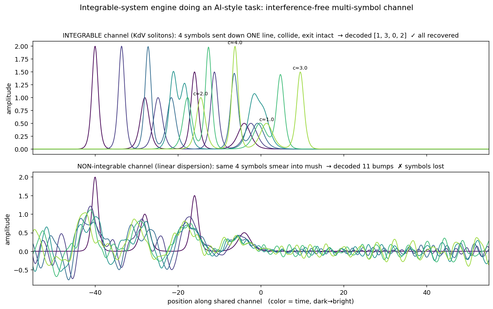

# 标准一：孤立子信道（无串扰多符号传输）

**物理引擎**：KdV 方程的孤立子（可积系统）。
**AI 任务**：把多个符号编码进同一条信道、传输途中互相对撞、在另一端原样解码。
**验收标准**：标准一（点亮空白格——证明可积系统能干一件 AI 活）。



## 任务

把 4 个符号（编码成 4 个不同高度的孤立子）塞进**同一条线**里发出去，让它们在传输途中互相追上、对撞，最后在另一端把 4 个符号原样读回来。数据是抽象符号 `[3,1,2,0]`，跟物理无关。

## 引擎与对照

- 引擎：KdV `u_t + 6 u u_x + u_xxx = 0` 的孤立子（符号→振幅，越高跑得越快），积分因子 RK4 求解。
- 对照：非可积介质（纯线性色散）。

## 结果

- 可积（上半图）：孤立子对撞后**形状、高度原封不动**地分开 → 4 个符号全部解回。
- 非可积（下半图）：同样的符号传一会儿就**散成乱波** → 符号全丢。

## 这证明了什么 & 边界

同一件 AI 活，可积引擎干得成、非可积干不成 → 点亮"可积系统"空白格。
**边界**：这是演示"结构能做这件事"，还没到工程化（可训练 + benchmark）。另外"多路信息共用通道互不污染"Transformer 注意力也做得不错，所以本 demo 属标准一、不属标准二。

## 运行

```bash
pip install numpy matplotlib
python soliton_channel.py   # 生成 soliton_channel_demo.png
```
