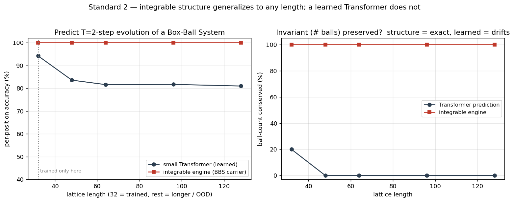

# 标准二：箱球系统 vs Transformer（超训练长度的外推）

**物理引擎**：Box-Ball System（BBS），KdV 的超离散极限，一个可积元胞自动机。
**AI 任务**：给一个 01 状态，预测它演化若干步后的状态（序列预测）。
**验收标准**：标准二（结构赢过规模——在 Transformer 的死穴上赢它）。



## 设置

只在长度 **L=32** 的格子上训练一个小 Transformer（3 层、d=64、正弦位置编码，能接受更长输入），然后把测试格子拉到 48 / 64 / 96 / 128（超出训练长度 = OOD）。孤立子大小与密度在所有长度上固定 → 纯粹的**长度外推**测试。对照是把可积更新规则（一次可逆的"搬运工"扫描）当引擎。

## 结果

| 格子长度 | Transformer 逐位准确率 | Transformer 守恒球数 | 可积引擎 |
|---|---|---|---|
| 32（训练） | 94.2% | 20.0% | 100% / 100% |
| 48 | 83.6% | 0.0% | 100% / 100% |
| 64 | 81.6% | 0.0% | 100% / 100% |
| 96 | 81.7% | 0.0% | 100% / 100% |
| 128 | 81.0% | 0.0% | 100% / 100% |

可积引擎另经验证**精确可逆**：能从输出一步步倒推回原始输入，一个比特不差。
（数值随机种子不同会有小幅波动，趋势一致。）

## 这证明了什么

同一件 AI 活（预测一个非线性可逆动力学的演化），可积结构在任意长度上精确、守恒、可逆；学出来的 Transformer 在训练长度外就崩、还破坏守恒量。**结构赢过规模，赢在"超出训练分布"这个 Transformer 公认的死穴上。**

## 诚实边界（三条）

1. 可积引擎的规则是**搭进去的**（它本就是真值生成器），所以 100% 是"结构自带"，不是"学得更好"。本 demo 证明的是**带可积结构的归纳偏置能外推、纯学习不能**。
2. "循环 / 结构化模型长度外推优于 Transformer"这半个结论与已有文献重叠（见 `../../CATALOG.md`）。可积**独家**贡献的是"精确守恒 + 精确可逆"那条线。
3. CPU 上几分钟的小模型 + 玩具任务。要变成可发表证据需放大规模、上更强 baseline、设计"必须非线性 + 精确守恒两头都占"的任务。

## 运行

```bash
pip install torch numpy matplotlib   # CPU 即可
python box_ball_system.py            # 训练 + 评估 + 生成 bbs_standard2_demo.png
```
