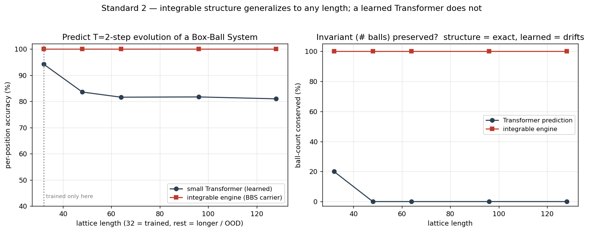

# Integrable & Reversible Systems

> The first mined family of the [Physics Model Library](../README.md): the 🔴 *integrable systems* cell, promoted from a demo folder into a full research project.
> Goal: a research paper for `cond-mat.dis-nn` / `nlin.SI`.

## The claim (one sentence)

**A genuinely *trained* neural network that carries integrable/reversible structure as an inductive bias beats a Transformer on the class of tasks that structure fits, and throws in exact reversibility and conservation for free — approaching the hard-coded integrable ideal, but reaching it by learning.**

Full motivation, technical plan, benchmark strategy, and related work: **[proposal.md](proposal.md)**.

## Why integrable systems first

Integrable systems sit in a 🔴 near-empty zone, and they have a temperament unique in all of physics:

> **Infinitely many exact conserved quantities + full time-reversibility + never chaotic + exactly solvable by the inverse scattering transform.**

They can push a *nonlinear* system forward arbitrarily far and rewind it exactly, without losing a single bit. Their signature is the **soliton**: two waves collide, pass through each other, and come out with their shapes perfectly intact, off by only a phase shift.

By contrast: Hamiltonian networks give only approximate energy conservation and can go chaotic; linear state-space models are structurally too weak; a Transformer's learned conservation is approximate and drifts as sequences grow. **Only integrable systems hold nonlinear + exactly reversible + exactly conserved + non-chaotic all at once.** Bar 2 is staked on that combination.

## Status

**Preliminary demos** (in [`demos/`](demos/)): `soliton_channel/` (Bar 1, motivation) and
`box_ball_system/` (Bar 2, hard-coded upper-bound preview).

**Experiments** — honest index (each folder has its own write-up):

| experiment | what | outcome |
|---|---|---|
| [`experiments/box_ball_learned_vs_transformer/`](experiments/box_ball_learned_vs_transformer/) | 5 tests, multi-seed, finite-carrier BBS | ✅ **positive, genuine learning (no leak).** Structural *exactness* composes without drift where free-emit scan models drift; a bolt-on control shows **conservation is bolt-on-able, exactness is not** (9–21 pt gap it can't close). |
| [`experiments/margolus_block_ca/`](experiments/margolus_block_ca/) | 2nd reversible system, multi-seed + bolt-on | ✅ **recipe transfers** — "same recipe, different backbone"; free-form (even + bolted conservation) collapses under `T∝L`, structural stays 100/100. |
| [`experiments/toda_lattice/`](experiments/toda_lattice/) | the *true*-integrable target (Toda) | ❌ **scoped negative result** (2 attempts, both F2). Free-form composing already solves smooth continuous Toda, so no gap for structure — empirically confirms the **discrete→continuous** barrier. Recorded, **not used for the paper.** |
| [`benchmark/`](benchmark/) | Integrable Extrapolation *attempt* (multi-soliton BBS) + [next benchmark proposal](benchmark/BENCHMARK_PROPOSAL.md) | ❌ **not a valid benchmark yet — the winner leaks.** The single-seed leaderboard shows generic models + bolt-on fail to preserve soliton content (real), **but** the structural winner is *hardcoded* on plain BBS (carrier-blind also 100%) — so it does **not** yet show learned integrable success. Earns the name only with a finite-carrier (no-leak) entrant + spec + multi-seed. The proposal defines the family-level benchmark that should replace this attempt. |

Bottom line: the **positive, genuinely-learned** result is the box-ball (finite-carrier) + Margolus
pair (exactness beats free-form, conservation is bolt-on-able); the Toda push is an honest **negative**;
the multi-soliton benchmark is **not yet a genuine-learning result** (leak).

## Structure

```
integrable_reversible/
├── README.md              ← this file: the project's front door
├── proposal.md            ← the research plan (motivation / method / benchmarks / related work)
│
├── demos/                 ← finished preliminary experiments (archive)
│   ├── soliton_channel/       crosstalk-free soliton channel (Bar 1, motivation)
│   └── box_ball_system/       Box-Ball System vs Transformer (Bar 2, upper-bound preview)
│
├── data/                  ← §4 generators for the three benchmark classes
│   ├── reversible_systems/    (1) main: BBS / Margolus CA / Toda lattice
│   └── synthetic/             (2) semi-synthetic: modular arithmetic / reversible circuits / brackets
│
├── models/                ← §2 the three lines on the money plot
│   ├── integrable_exact/      Route A: hard-coded integrable (BBS), ideal upper bound
│   ├── reversible_net/        Route C: reversible coupling net + learned F — ★ main model
│   └── transformer/           baseline: lower bound
│
├── eval/                  ← §3 money plot + four diagnostics (accuracy / conservation drift / reversibility / soliton viz)
├── experiments/           ← the actual experiments (box-ball ✅ / Margolus ✅ / Toda ❌ negative) — see index above
├── benchmark/             ← Integrable Extrapolation (multi-soliton BBS) — 🚧 partial, see index above
└── paper/                 ← manuscript draft + figures
```

| Path | What | proposal § |
|---|---|---|
| [`proposal.md`](proposal.md) | research plan | whole |
| [`demos/`](demos/) | finished preliminary experiments (archive) | §1 |
| `data/` | generators for the three benchmark classes | §4 |
| `models/` | the three lines on the money plot (below) | §2 |
| `eval/` | money plot + four diagnostics | §3 |
| `experiments/` | training scripts + configs (reproduce results) | §2 steps |
| `paper/` | manuscript draft + figures | — |

**`models/` — the three lines:**
- `integrable_exact/` — **Route A**: hard-coded integrable (BBS), the ideal upper bound (ceiling).
- `reversible_net/` — **Route C**: reversible coupling net + learned collision operator F. **The main model.**
- `transformer/` — **baseline**: lower bound (collapses past training length, breaks conservation).

## Demos

### Demo 1 — Soliton channel · Bar 1

Encode four abstract symbols `[3, 1, 2, 0]` as four KdV solitons of different heights, send them down a *single* channel, let them collide in transit, and read all four back at the far end. The data is abstract symbols; nothing about the task is physical.


- **Integrable engine (top):** the solitons collide and separate with shape and height untouched → all four symbols decoded.
- **Non-integrable control (bottom, pure linear dispersion):** the same symbols smear into noise → symbols lost.

Same AI task, the integrable engine does it and the non-integrable one cannot → the integrable cell lights up. **Honest boundary:** this shows *structure can do it*, not yet an engineered, trainable, benchmarked model — and attention routes multiplexed information fairly well too, so this is Bar 1, not Bar 2. → [details](demos/soliton_channel/README.md)

### Demo 2 — Box-Ball System vs Transformer · Bar 2

The Box-Ball System (BBS) is the ultradiscrete limit of KdV — an integrable cellular automaton. Task: given a 0/1 state, predict its state several steps later. We train a small Transformer (3 layers, d=64, sinusoidal positions) **only on length L=32**, then test on lengths 48 / 64 / 96 / 128 — out of distribution by length alone (soliton size and density held fixed across lengths).



| Lattice length | Transformer per-cell accuracy | Transformer conserved ball-count | Integrable engine |
|---|---|---|---|
| 32 (train) | 94.2% | 20.0% | 100% / 100% |
| 48 | 83.6% | 0.0% | 100% / 100% |
| 64 | 81.6% | 0.0% | 100% / 100% |
| 96 | 81.7% | 0.0% | 100% / 100% |
| 128 | 81.0% | 0.0% | 100% / 100% |

The integrable engine is exact, conserved, and **bit-perfectly reversible** at every length; the trained Transformer collapses past its training length and destroys the conserved quantity. **Structure beats scale, on the out-of-distribution length that is the Transformer's acknowledged blind spot.**

Honest boundaries, three of them:

1. The integrable rule is *built in* (it is the ground-truth generator), so 100% is "structure by construction," not "learned better." What the demo shows is that an integrable inductive bias extrapolates where pure learning does not.
2. "Recurrent / structured models extrapolate in length better than Transformers" overlaps existing literature (see [../CATALOG.md](../CATALOG.md)). Integrable's *exclusive* contribution is the "exact conservation + exact reversibility" line.
3. Toy task, a few minutes on CPU. Turning this into publishable evidence means scaling up, adding stronger baselines, and designing tasks that demand *both* nonlinearity and exact conservation.

→ [details](demos/box_ball_system/README.md)

## What is and isn't novel here

Honest, in three layers (full version in [../CATALOG.md](../CATALOG.md)):

- **Integrable systems + deep learning** — plenty of people do it, but in the *opposite* direction: using neural nets to solve or discover integrable systems (Lax-pair networks, Darboux-transform nets, conservation-law PINNs, SILO). That is "AI as the tool, physics as the goal" — exactly what we avoid.
- **The Box-Ball System** — well studied in mathematical physics (Takahashi–Satsuma 1990; Ferrari et al. 2018), but apparently no one has run it as a *sequence model trained on an AI task and benchmarked against a Transformer*.
- **Length extrapolation** — that structured/recurrent models extrapolate where Transformers don't is an established result (I-BERT; Liu et al. 2023; Merrill & Sabharwal 2023/2024). So the novelty here is the *carrier and the framing, not the capability*.

The collisions are all at the level of parts; nothing collides at the level of the skeleton. **No one has assembled these into "physics is a systematically mineable model library, integrable systems are one un-mined mine, and the proof happens on AI's own turf."** That organizing logic is the point.

## Reproduce the demos

```bash
# Demo 1 — soliton channel
cd demos/soliton_channel && pip install numpy matplotlib && python soliton_channel.py

# Demo 2 — box-ball system vs Transformer (CPU is enough)
cd demos/box_ball_system && pip install torch numpy matplotlib && python box_ball_system.py
```
