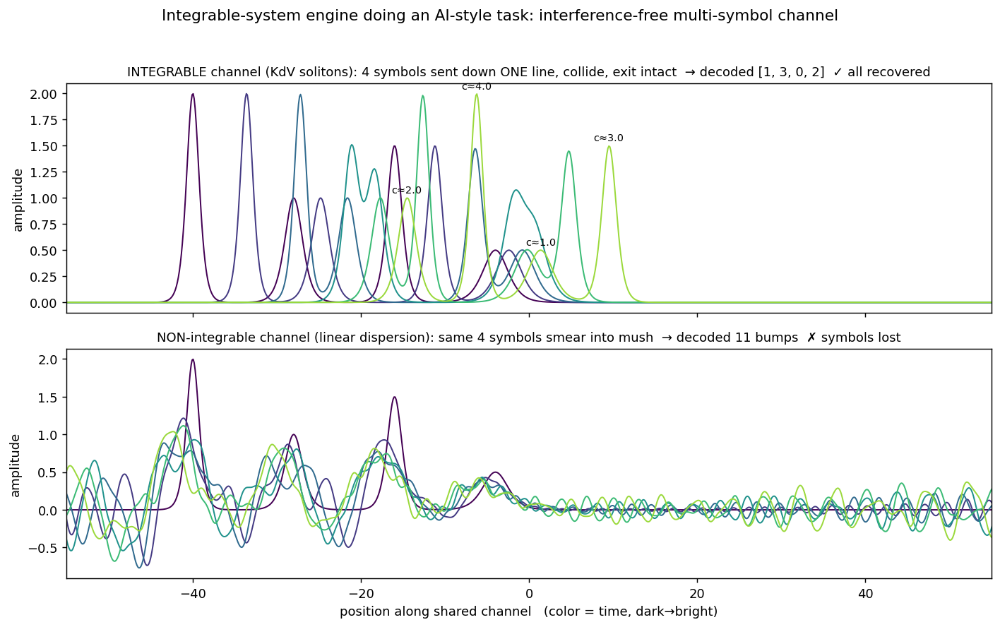

# Demo 1 · 孤立子信道（无串扰多符号传输）

**物理引擎**：KdV 方程的孤立子（一个可积系统）。
**AI 任务**：把多个符号塞进**同一条信道**、让它们在传输途中互相对撞、在另一端**原样解码**回来。
**验收标准**：标准一 / Bar 1（点亮空白格——证明可积系统能干一件 AI 活）。



---

## 一句话：它到底在干嘛

想象你要用**一根管子**同时寄 4 个包裹。普通的波（比如水波）塞进一根管子会**互相干扰、糊成一团**，到另一头就分不清谁是谁了。这个 demo 用一种特殊的波——**孤立子（soliton）**——来当信使：它们即使在管子里**互相追上、对穿而过**，出来之后**每一个的形状、高度都一点没变**，于是 4 个包裹全都能原样取回。

**数据是抽象符号 `[3,1,2,0]`，跟物理无关**——这一点很关键。我们不是在"解物理题"，而是在用物理结构干一件通信/编码的活（把多路信息复用进一条通道）。这正是本项目的铁律：物理只当发动机，任务本身是 AI 的活。

---

## 背景：什么是孤立子，它凭什么特殊

绝大多数波都会**弥散（dispersion）**：一个尖脉冲随时间会摊开、变矮、变宽，最后散掉——就像往平静水面丢一块石头，涟漪越扩越淡。

**孤立子是一个例外**。它出现在某些**非线性**方程里（这里是 KdV 方程），靠的是两种效应**精确抵消**：

- **弥散**想把波摊平（高频跑得快，把波拉散）；
- **非线性**想把波聚拢、变陡（振幅大的地方跑得快，把波往前堆）。

两者恰好平衡，波就**锁成一个稳定的形状，能永远保持不变地传播**。更神奇的是它的招牌绝技——**两个孤立子对撞，会互相穿过对方，出来后各自形状、高度完全不变，只是位置被推移了一点点（一个"相位移"）**。就像两个鬼魂互相穿身而过，谁也没被撞碎。

这就是"无穷多守恒量 + 精确可逆 + 不混沌"这套可积系统脾气的直观后果。

---

## 这个 demo 的三步

### ① 编码：符号 → 孤立子的高度

KdV 孤立子由一个参数 `c` 决定，它同时是这个孤立子的**速度**，而振幅（高度）= `c/2`。KdV 的铁律是：**越高 = 越快 = 越窄**。

```
符号 0 → c=1 (矮、慢)
符号 1 → c=2
符号 2 → c=3
符号 3 → c=4 (高、快)
```

要发的消息 `[3,1,2,0]` 就变成 4 个不同高度的孤立子，一字排开放进信道。

### ② 传输：让它们在同一条线里对撞

起点故意排成 `[-40,-28,-16,-4]`，把**最高最快的（符号 3，c=4）放在最后面**。于是它一路**追上并穿过**前面那些矮的——这就制造了碰撞。整段用 KdV 方程往前演化（相当于"信号在信道里跑了一段时间"）。

### ③ 解码：在出口读出每个孤立子的高度

到了另一端，扫描波形找出每个峰，量它的高度 `h`，反推参数 `c ≈ 2h`，再对回最接近的符号。因为孤立子碰撞不损、高度不变，所以 4 个高度原样都在 → 4 个符号全部读回。

**判定标准**：`sorted(解码结果) == sorted(发送消息)`。也就是检查"这 4 个符号作为一个集合有没有全须全尾活下来"。（碰撞会把孤立子的位置推移，所以我们比的是**集合**，不是它们的先后顺序——见下方诚实边界。）

---

## 对照组：换一根"只会弥散"的信道就废了

下半图是对照：把方程里的**非线性项删掉，只留弥散**（`u_t + u_xxx = 0`）。没有了非线性来平衡，4 个脉冲失去了"锁形状"的能力，传一会儿就**摊开、互相重叠、糊成一坨碎波**。解码器一扫，数出 11 个乱七八糟的小包，符号全丢。

**同一件 AI 活（多符号共用一条信道、互不污染），可积引擎干得成，换一根普通弥散信道就干不成 → 点亮"可积系统"这个空白格。**

---

## 图怎么看

- 两幅图各是一条信道里波形随时间的叠放，**颜色由暗到亮 = 时间从早到晚**。
- **上图（可积 / KdV）**：能看到高的孤立子追上矮的、在中间叠在一起（碰撞），然后又干净地分开，每个高度都还在 → 标题显示 `✓ all recovered`。
- **下图（非可积 / 线性弥散）**：同样 4 个包越传越散、越叠越乱 → `✗ symbols lost`。

---

## 实测结果（本机跑过）

```
sent      : [3, 1, 2, 0]           c = [4, 2, 3, 1]
INTEGRABLE: [1, 3, 0, 2]           recovered all? True     max|u| ≈ 1.995
non-integ : 11 bumps               recovered all? False
```

- `max|u| ≈ 1.995`：最高的孤立子振幅应是 `c/2 = 2.0`，碰撞若干次之后仍是 1.995 → **高度守恒到 0.2%**（其中大部分误差还只是网格采样、不是真的衰减）。
- 解码出的顺序 `[1,3,0,2]` 正是出口处从左到右的空间顺序（由 `起点 + 速度×时间` 算出来完全对得上），所以判定用"集合相等"是合理的。

---

## 实现说明（数值方法，已验证正确）

- KdV `u_t + 6 u u_x + u_xxx = 0`，用**谱方法 + 积分因子 RK4**（Fourier 空间）求解——即经典的 Trefethen `p27` 方案，按 `+6` 这个系数约定改写（非线性系数 `g = -3ik·dt`）。
- **正确性交叉验证**：单个孤立子演化 8 个时间单位后，与"精确平移解"的 L2 误差 `9.5e-13`；KdV 的守恒量（质量 `∫u`、动量 `∫u²`）漂移分别 `1.6e-16`、`3e-13`——都到机器精度。**方案是对的，精度极高。**

---

## 诚实边界

1. **这是纯物理模拟，没有任何神经网络、没有训练。** 它演示的是"可积这个物理结构能干这件事"，还没到工程化（可训练 + 上 benchmark + 跟 Transformer 实测）。所以属**标准一**，不属标准二。
2. **"多路信息共用一条通道、互不污染"这件事，Transformer 的注意力其实也做得不错**，所以本 demo 不声称"别人做不到"。
3. **判定比的是符号"集合"，不是位置 / 顺序。** 碰撞给孤立子一个相位移，位置会变，所以证明的是"4 个符号作为多重集被无损保全"，不是"按位解码"。
4. **措辞上的一个精确性**：下半图的对照（线性弥散方程）严格来说是**线性、可精确求解**的，把它叫"非可积"是通俗说法。真正的对比是：**孤立子靠"非线性 ↔ 弥散"的平衡锁住形状，而对照组只剩弥散、没有平衡，所以摊开**。要点在"有没有孤立子这种稳定结构"，不在数学意义的可积性。
5. **初始条件是几个孤立子的简单相加**，并非 KdV 严格的 N-孤立子解；但只要它们初始分得够开，演化后会各自理顺成干净的孤立子，标准做法，不影响结论。

---

## 运行

```bash
pip install numpy matplotlib
python soliton_channel.py   # 打印解码结果 + 生成 soliton_channel_demo.png
```
