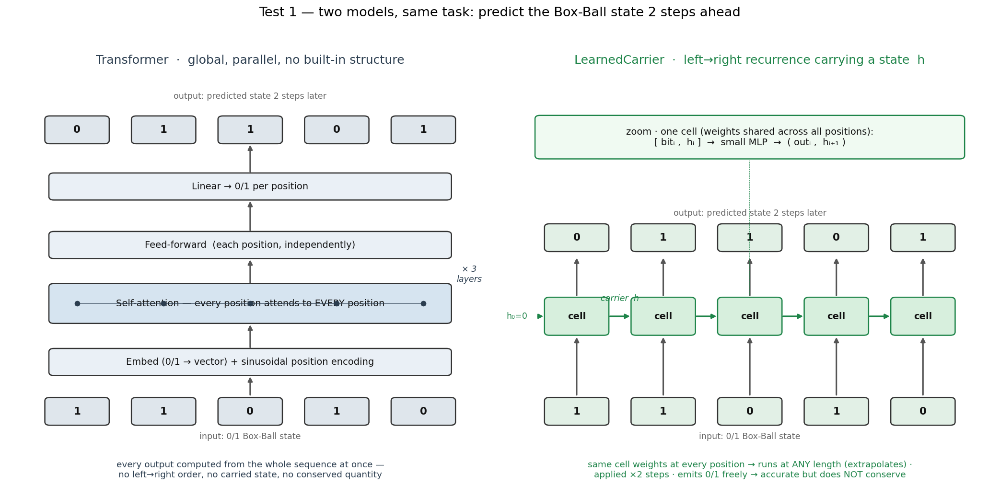
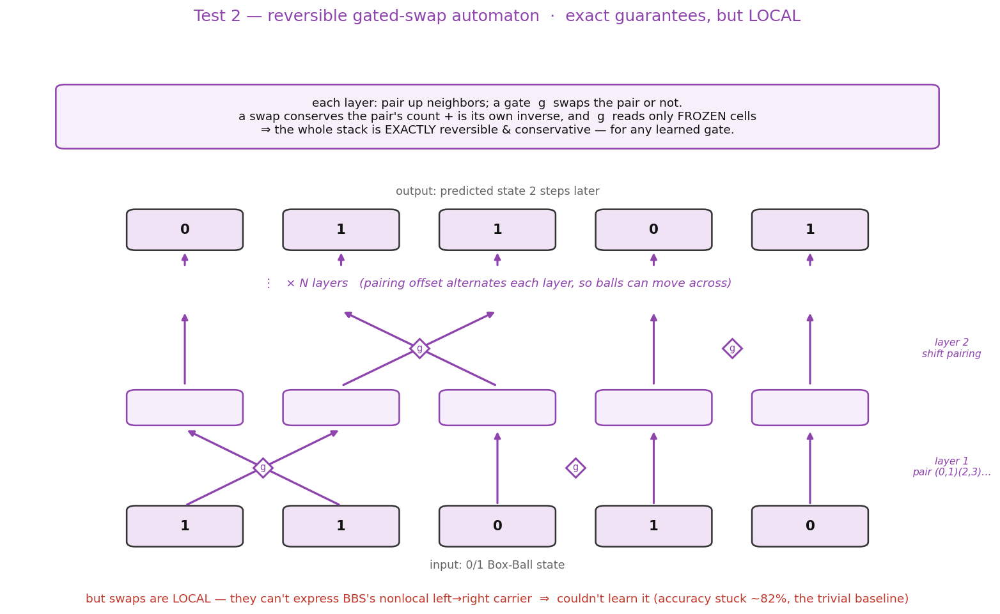
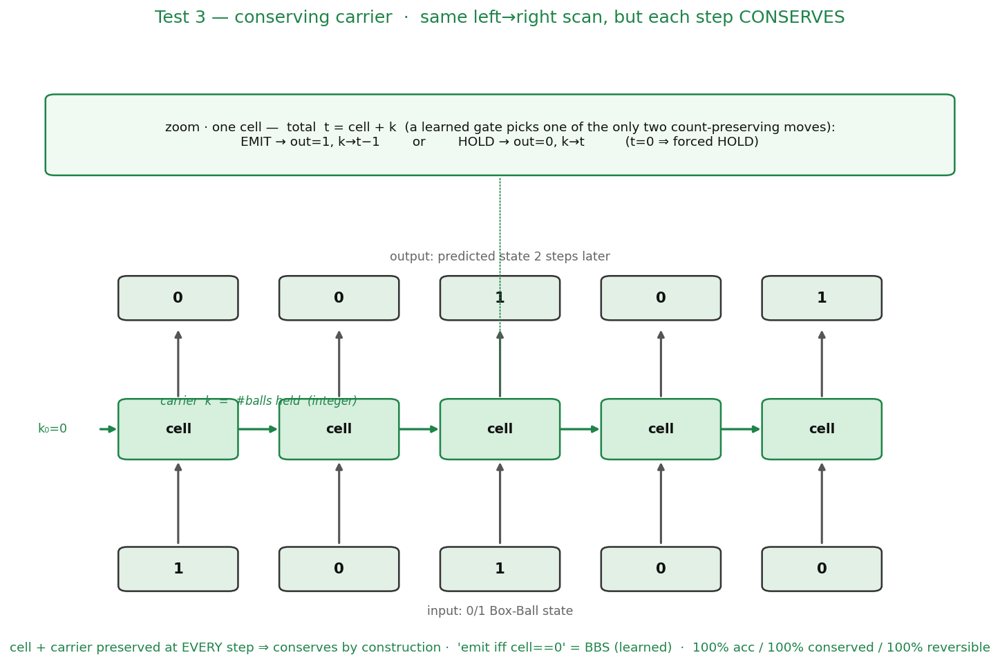

# Learning an integrable model on the Box-Ball System (3 tests)

**English** · [中文](README.zh-CN.md)

Demo 2 showed a hard-coded integrable rule (the Box-Ball System, BBS) beating a Transformer on length extrapolation — but that was a **cheat**: the "integrable engine" *is* the rule that generated the labels, so its 100% is tautological. This folder removes the cheat and asks the real question:

> Can a **genuinely trained** model, carrying an integrable-style inductive bias, beat a Transformer on the BBS length task — and add **exact conservation and reversibility**, by learning rather than by hard-coding?

**We ran 3 tests** — three iterations of the *same* investigation, not three separate experiments (hence one folder, files `01/02/03`). Together they are the proposal's "Route C" (a learned model with integrable structure). Answer: **yes — test 3 lands it.**

## The task

BBS is the ultradiscrete limit of KdV, an integrable cellular automaton on a 0/1 lattice: blocks of 1s are "solitons" that move right and pass through each other, ball-count is conserved, and the dynamics are exactly reversible. Task: given a 0/1 state, predict its state after **2 steps**. Every model is trained **only on length L=32**, then tested on 48/64/96/128 — out of distribution by length alone (soliton size and density fixed). Measured at every length: **per-position accuracy** and whether the **ball-count is conserved**.


> The `01/02/03` scripts train on random L=32 states like this one. Here a **size-3 soliton (fast) overtakes a size-1 and a size-2, passing _through_ them** — the order swaps, the sizes stay intact, and all 6 balls persist. The `input` (t=0) and `+2 = target` (t=2) rows are the pair the models actually see; the extra steps just show the dynamics. Made by [`bbs_data_l32.py`](bbs_data_l32.py).

## The three tests at a glance

| # | Model introduced | Idea | Outcome |
|---|---|---|---|
| 1 | plain carrier | remove the cheat: a learned left→right scan, rule learned not hard-coded | accuracy extrapolates; **conservation drifts** |
| 2 | reversible swap-automaton | weld the guarantees: conservation & reversibility exact by construction | guarantees exact, but **can't learn** BBS |
| 3 | **conserving carrier** | unite both: carrier reach + a per-site conservation constraint | **100% accuracy, 100% conservation, 100% reversible** |

**Punchline** — the models at OOD lengths:

| model | accuracy (OOD) | conservation | reversible | learned? |
|---|---|---|---|---|
| Transformer | collapses (~81%) | ~0% | no | yes |
| plain carrier | ~99% | drifts (76→39%) | no | yes |
| reversible swap-automaton | ~82% (trivial) | 100% | 100% | yes |
| **conserving carrier** | **100%** | **100%** | **100%** | **yes** |
| hard-coded integrable | 100% | 100% | 100% | no (cheat) |

The two "failures" weren't detours — they located the answer. #1 showed recurrence buys accuracy but not the invariant; #2 showed a guarantee that can't express the rule is worthless; #3 kept #1's reach and #2's discipline and got all three.

---

## The three architectures

All three are drawn the same way — input at the bottom, the predicted state 2 steps later on top; the internal boxes/arrows are schematic, but the shown input→output is the *real* Box-Ball mapping. (Generated by [`architecture_diagrams.py`](architecture_diagrams.py).)

**1 · Transformer  vs  plain carrier** — the two base models

> **Transformer**: global self-attention — every output from the whole sequence at once; no order, no carried state, no invariant. **Carrier**: one weight-shared cell scans left→right carrying a state `h`, so it runs at any length.

**2 · Reversible swap-automaton** — exact guarantees, but local

> Stacked gated swaps of neighbor pairs (pairing alternates each layer). A swap conserves the pair's count + is its own inverse, and the gate reads only frozen cells → exactly reversible & conservative *by construction* — but the swaps are **local**, so it can't express BBS's nonlocal carrier.

**3 · Conserving carrier** — the one that works

> The same left→right scan as #1, but the carrier is an integer ball-count `k` and each cell may only **emit** (out=1, k→t−1) or **hold** (out=0, k→t) — the two moves that preserve `cell + carrier`. Conservation is structural; the gate only learns *when* to emit (= BBS).

---

## Test 1 — plain learned carrier · removes the cheat, but doesn't conserve

*Script: [`01_plain_carrier.py`](01_plain_carrier.py)*

Replace the hard-coded rule with a **learned** left→right carrier — a weight-shared recurrent cell with a small carrier state, trained on L=32, applied at any length. It learns the rule from data (never sees it); the hard-coded integrable line stays only as a ceiling.


| Length | all-zeros | Transformer acc / cons | Plain carrier acc / cons |
|---|---|---|---|
| 32 | 84.2% | 94.5 / 29.0 | 94.1 / 32.7 |
| 48 | 83.7% | 83.7 / 0.0 | 93.3 / 21.7 |
| 64 | 82.9% | 82.0 / 0.0 | 92.5 / 12.0 |
| 96 | 82.7% | 81.8 / 0.0 | 92.5 / 6.0 |
| 128 | 82.3% | 80.9 / 0.0 | 92.1 / 3.3 |

**Finding.** The carrier holds ~92% accuracy at every length while the Transformer collapses to the all-zeros baseline (out of distribution it learned almost nothing). So a length-independent structure that *learns* the rule extrapolates where attention doesn't — cheat removed, conclusion intact. **But** its conservation drifts toward zero: recurrence buys accuracy, not the invariant.

## Test 2 — reversible swap-automaton · exact guarantees, but can't learn the rule

*Script: [`02_reversible_swap_ca.py`](02_reversible_swap_ca.py)*

Weld the guarantees. A stack of **gated swaps** of adjacent cells: a swap conserves the pair's count and is its own inverse; the gate reads only frozen context + the swap-invariant pair sum, so the whole stack is exactly invertible no matter what it learns. Verified at random init (before any training): ball-count conserved exactly and `invert(forward(x)) == x` exactly, at all lengths.


| Length | Transformer acc / cons | plain carrier acc / cons | swap-automaton acc / cons |
|---|---|---|---|
| 32 | 94.8 / 32.0 | 99.6 / 95.7 | 83.3 / **100** |
| 48 | 82.2 / 9.3 | 99.8 / 96.7 | 82.5 / **100** |
| 64 | 80.1 / 1.0 | 99.6 / 93.0 | 81.6 / **100** |
| 96 | 74.8 / 5.7 | 99.5 / 86.0 | 81.5 / **100** |
| 128 | 71.9 / 7.0 | 99.5 / 82.3 | 80.8 / **100** |

**Finding.** Conservation is a flat 100% and reversibility exact — the guarantees work. But the *local* swap structure **can't learn** BBS: accuracy stalls at ~82% (the trivial baseline), loss plateaus at 0.15 while the carrier reaches 0.02. BBS transport needs the carrier's nonlocal left→right reach, which a local gate lacks. **A structural guarantee that can't express the rule is worthless — the guarantee-vs-expressivity tension.**

## Test 3 — conserving carrier · learns it, and conserves + reverses exactly

*Script: [`03_conserving_carrier.py`](03_conserving_carrier.py)*

Unite both. Keep the **carrier's reach** (test 1) but constrain its per-site update to **conserve** (test 2's discipline). With carrier count `k` and cell `c`, total `t = c + k`; the only count-preserving outcomes are *emit* (`out=1, k'=t−1`) or *hold* (`out=0, k'=t`); a learned gate picks between them. BBS itself is just the fixed rule "emit iff cell==0" — here that rule is *learned*.


| Length | Transformer acc / cons | plain carrier acc / cons | **conserving carrier** acc / cons |
|---|---|---|---|
| 32 | 94.5 / 29.0 | 98.9 / 76.3 | **100.0 / 100.0** |
| 48 | 83.7 / 0.0 | 99.1 / 70.7 | **100.0 / 100.0** |
| 64 | 82.0 / 0.0 | 98.7 / 57.3 | **100.0 / 100.0** |
| 96 | 81.8 / 0.0 | 98.4 / 41.0 | **100.0 / 100.0** |
| 128 | 80.9 / 0.0 | 98.4 / 38.7 | **100.0 / 100.0** |

Reversibility (whole-sequence, via the BBS mirror trick `inv = mirror·step·mirror`): **100%**. Training loss → 0.0001.

**The clean isolation.** Plain carrier (test 1) and conserving carrier (test 3) have the *same* reach and both learn the task; the only difference is free-emit vs count-preserving emit/hold. That single change flips conservation from **drifting (76→38%)** to a **flat 100%** — clean evidence the invariant comes from the structural constraint, not scale/data/reach.

### What is guaranteed vs learned (precise)

- **Per-site conservation — structural (any gate).** Each site preserves `cell + carrier`; the gate can only choose emit vs hold, never create or destroy a ball.
- **Whole-output conservation = 100% — structural bias + learned.** Output ball-count = input's minus whatever remains in the carrier at the end; the learned gate empties the carrier over the trailing zeros, so measured conservation is exactly 100%. (A deterministic end-of-scan flush would make this unconditional; it wasn't needed.)
- **Reversibility = 100% — learned rule + structure, verified.** The model learned (essentially) BBS, which is exactly invertible by the mirror trick; verified whole-sequence. Not a hard guarantee for arbitrary gates.
- **Accuracy — learned, and it extrapolates.** Weight-shared, length-independent update → 100% out to L=128.

---

## Honest boundaries

1. **Single seed, toy scale, one task (BBS).** Numbers wobble across seeds (that is why the Transformer / carrier columns differ slightly between tests). A real version needs multiple seeds with mean ± error bars.
2. **The architecture closely matches BBS's structure** (carrier + emit/hold). That is the point — the right inductive bias makes the rule learnable and exactly extrapolable — but it means the open question is now **generality**: does the same recipe learn *other* reversible systems (Margolus CA, Toda), not just the one it structurally fits?
3. **Global conservation relied on the carrier emptying** (it did, 100%); a flush would make it unconditional.

## Where it stands / next

This is the shape of the result the project aimed for: a genuinely trained model with an integrable-style bias that (i) beats the Transformer on OOD length, (ii) matches the hard-coded integrable ceiling on accuracy, and (iii) adds exact conservation and reversibility — reached by learning, not hard-coding. The next step is the **generality study** (same recipe on other reversible systems, multiple seeds, error bars) — the `data/reversible_systems/` plan in [`../../proposal.md`](../../proposal.md), and the step that turns this from a clean demo into a publishable result.

## Reproduce (CPU, a few minutes each)

```bash
pip install torch numpy matplotlib
python 01_plain_carrier.py        # remove the cheat
python 02_reversible_swap_ca.py   # weld guarantees (can't learn)
python 03_conserving_carrier.py   # the one that works
```
