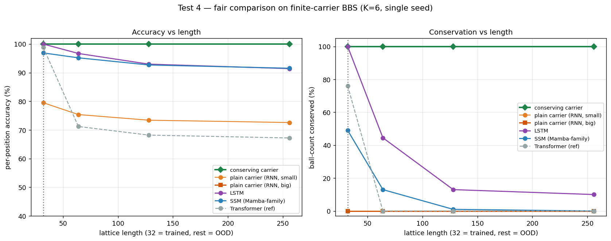

# 在箱球系统上学一个可积模型（3 个 test）

[English](README.md) · **中文**

Demo 2 里,一个硬编的可积规则(箱球系统 BBS)干了一件 Transformer 干不了的长度外推——但那是**作弊**:那个"可积引擎"就是生成标签的规则本身,所以它的 100% 是同义反复。这个文件夹去掉作弊,问真正的问题:

> **守恒(和可逆)能不能做成结构保证**——by construction、不是学的——并且模型能不能**在这个结构之上,真学到一条可外推**到更长长度的规则?

**我们一共跑了 3 个 test** —— 它们是**同一个**研究的三次迭代,不是三个独立实验(所以放在一个文件夹里,编号 `01/02/03`)。三者合起来就是 proposal 里的"路线 C"(带可积结构的学习模型)。**答案:能——Test 3 拿下了:守恒是结构性的(任意门都 100%),其上坐着一条真学出来、可外推的残差(无视进位的门 89%,学出来的门 100%)。**

> **"打赢 Transformer"不是核心成果。** 这里任何带左→右扫描的模型都能在长度外推上赢无结构的 Transformer——但这**在意料之中**、与已知的"循环/状态追踪能外推、注意力不能"结论**重叠**,而且**不公平**(Transformer 没有扫描先验)。它只当"无结构参照"留着。**真正公平、有区分度的对照,是跟同样带扫描先验的模型比——RNN / LSTM / Mamba(SSM)——比较点是*谁的守恒量精确、谁随长度漂*,而不是谁准确率更高。** 这才是结构性守恒独家买到的东西。

## 任务

BBS 是 KdV 的超离散极限,一个 0/1 格子上的可积元胞自动机:成块的 1 是"孤立子",向右走、互相穿过,球数守恒,动力学精确可逆。任务:给一个 0/1 状态,预测它演化 **2 步**后的状态。所有模型都**只在长度 L=32 上训练**,再测 48/64/96/128——纯粹按长度 OOD(孤立子大小与密度固定)。每个长度上测两样:**逐位准确率**、以及**球数守没守住**。


> `01/02/03` 脚本训练的就是这样的随机 L=32 状态。这里一个 **size-3 孤立子(快)追上 size-1 和 size-2,并从它们中间穿过** —— 前后顺序互换、大小不变、6 个球始终都在。`input`(t=0)和 `+2 = target`(t=2)这两行才是模型真正看到的;多出来的步只是展示动力学。由 [`bbs_data_l32.py`](bbs_data_l32.py) 生成。

## 三个模型 —— 诚实审计(结构 vs 学习)

同一个任务(预测箱球状态 2 步后),三个模型。真正要问的不是"work 不 work",而是**有多少是写死的结构、多少是真学的**——用"把可学习的门换成一行固定规则、看掉不掉分"来量化。

| 模型 | 是什么 | 可学 weight 决定什么 | 守恒 · 可逆 | 真学到多少(固定规则审计) | 诚实结论 |
|---|---|---|---|---|---|
| **Test 1 — 普通搬运工** | RNN:左→右扫描 + 24 维通用隐状态;自由吐位 | 整个 cell(`net/out/hnext`);**无结构约束** | 守恒:**漂**(非结构) · 可逆:**无** | 学**整条规则**(~92–99%)但不守恒;硬编 `emit=1−cell` 反而更好(100%) | "循环能学规则+外推"(与文献重叠);**没守恒** |
| **Test 2 — 交换自动机** | 相邻对门控交换,层叠;无进位 | 只学*换/不换*;交换本身写死 | 守恒 · 可逆:**都结构保证**(任意 weight) | **学不动**:固定门和学习门都封顶 ~82% | "守恒+可逆可**完全结构化**";**学不会规则** |
| **Test 3 — 守恒搬运工**(finite-carrier BBS) | 进位扫描;`t=c+k`、`avail`、`k'=t−out` 写死 | 只有 emit 门 | 守恒:**结构(每步)** · 可逆:学+验证 | 固定 `emit=1−cell` = **89%** vs 学习 = **100%** → **真学 ~11%**(普通 BBS 上这个差=**0**,故弃用普通 BBS) | "在守恒结构上**真学到非平凡、可外推的残差**";**不能**说"无 leak / 公平赢 Transformer" |

**"结构写死 vs 模型真学"这条线,统一划。** Test 1 只写死"因果扫描 + 通用状态",学整条规则(但守恒漂)。Test 2 写死交换 + 守恒 + 可逆,只学"换不换"(但表达不出规则)。Test 3 写死进位扫描 + 守恒记账 + 容量约束,学 emit 决策——其中只有"满筐就让球穿过"那部分(~11%)非平凡。

**两条直说的诚实边界。** (1) **结构可逆只有 Test 2 有**——而 Test 2 恰恰**学不会**;能学的(Test 1、Test 3)只有"学+验证"的可逆。**没有一个模型同时做到"结构可逆 + 学会规则"。** (2) **没有一个能"公平打赢 Transformer"**:赢主要来自"左→右扫描"这个先验(与"循环/状态追踪外推优于注意力"的已有结论重叠)。要让"赢谁"有意义,得跟**同样有扫描先验的模型(RNN / SSM)**比;那时真正独家的贡献会收缩成**结构性的守恒/可逆保证**,而不是准确率。

---

## 三张架构图

三张图画法一致——输入在底,预测的"2 步后状态"在顶;内部方块/箭头是示意,但图上标的输入→输出是**真实**的箱球映射。(由 [`architecture_diagrams.py`](architecture_diagrams.py) 生成。)

**1 · Transformer  vs  普通搬运工** —— 两个基础模型

> **Transformer**:全局自注意力——每个输出都从整条序列一次算出;没有顺序、没有携带状态、没有不变量。**搬运工**:一套共享 cell 从左往右扫、携带状态 `h`,所以任意长度都能跑。

**2 · 可逆交换自动机** —— 保证精确,但局部

> 一叠相邻对的门控交换(每层错开配对)。交换保守对内球数、且是自己的逆,门只读被冻结的格子 → **by construction 精确可逆 + 守恒**;但交换是**局部**的,表达不了 BBS 的非局部进位。

**3 · 守恒搬运工** —— 结构保留,任务重做

> 和 #1 一样的左→右扫描,但进位是整数球数 `k`,每个 cell 只能**吐球**(out=1, k→t−1)或**留球**(out=0, k→t)——保守 `格子 + 进位` 的仅有两种走法。守恒是结构性的。(在普通 BBS 上"何时吐"这条规则平凡;Test 3 跑在 **finite-carrier BBS** 上,那里就不平凡了。)

---

## Test 1 — 普通学习搬运工 · 去掉作弊,但不守恒

*脚本:[`01_plain_carrier.py`](01_plain_carrier.py)*

把硬编规则换成一个**学出来的**左→右搬运工——权重共享的循环 cell + 一个小进位状态,只在 L=32 训练、任意长度都能跑。它从数据里学规则(从没见过);硬编可积那条线只当天花板。


| 长度 | 全 0 基线 | Transformer 准确率/守恒 | 普通搬运工 准确率/守恒 |
|---|---|---|---|
| 32 | 84.2% | 94.5 / 29.0 | 94.1 / 32.7 |
| 48 | 83.7% | 83.7 / 0.0 | 93.3 / 21.7 |
| 64 | 82.9% | 82.0 / 0.0 | 92.5 / 12.0 |
| 96 | 82.7% | 81.8 / 0.0 | 92.5 / 6.0 |
| 128 | 82.3% | 80.9 / 0.0 | 92.1 / 3.3 |

**发现。** 搬运工在所有长度稳在 ~92%,而 Transformer 崩到全 0 基线(OOD 上几乎啥也没学到)。所以"与长度无关、且学得会规则"的结构能外推、注意力不能——作弊去掉了,结论仍成立。**但**它的守恒往 0 漂:循环买到准确率,买不到不变量。

## Test 2 — 可逆交换自动机 · 保证精确,但学不会规则

*脚本:[`02_reversible_swap_ca.py`](02_reversible_swap_ca.py)*

焊保证。一叠相邻格的**门控交换**:交换保守这一对的球数、且是自己的逆;门只读被冻结的邻居 + 交换不变的对内总和,所以整叠**无论学成什么都精确可逆**。随机初始化(没训练)就验证过:所有长度上球数精确守恒、`invert(forward(x)) == x` 精确成立。


| 长度 | Transformer 准确率/守恒 | 普通搬运工 准确率/守恒 | 交换自动机 准确率/守恒 |
|---|---|---|---|
| 32 | 94.8 / 32.0 | 99.6 / 95.7 | 83.3 / **100** |
| 48 | 82.2 / 9.3 | 99.8 / 96.7 | 82.5 / **100** |
| 64 | 80.1 / 1.0 | 99.6 / 93.0 | 81.6 / **100** |
| 96 | 74.8 / 5.7 | 99.5 / 86.0 | 81.5 / **100** |
| 128 | 71.9 / 7.0 | 99.5 / 82.3 | 80.8 / **100** |

**发现。** 守恒平的 100%、可逆精确——保证成立。但**局部**交换结构**学不会** BBS:准确率停在 ~82%(平庸基线),loss 卡在 0.15,而搬运工能到 0.02。BBS 的搬运需要进位的**非局部左→右 reach**,局部门抓不住。**一个学不会规则的结构保证一文不值——这就是"保证 vs 表达力"的张力。**

## Test 3 —— 守恒搬运工跑在 *finite-carrier* BBS 上 · 一个真要学的非平凡规则

> 普通 BBS 被弃用了:把守恒焊进搬运工后,它的规则太平凡——写死 `emit = 1 − cell` 就已 100%(没啥可学;见上面的审计表)。finite-carrier BBS 保留同一结构,但让规则变非平凡。

*脚本:[`03_conserving_carrier.py`](03_conserving_carrier.py)*

**修法。** 保留一切好的东西——守恒搬运工结构(守恒仍是**结构性**的)、长度外推设置、Transformer 对照——但把**任务**从普通 BBS 换成 **finite-carrier BBS**:进位筐现在最多装 **K 个球**(这里 K=2)。**筐满了**的时候,新来的球只能**路过**、不能被收进筐。就这一改,让"吐不吐"的决策**依赖进位数 `k`**,于是 `emit = 1 − cell` 不再管用——模型被**逼着学会用进位**。


只在 L=32 训练、按长度 OOD 测试(finite-carrier BBS 训练前已验证守恒 + 可逆):

| 长度 | 天花板(硬编) | 无视进位(`emit=1−cell`)准确率/守恒 | **守恒搬运工(学的)** 准确率/守恒 | Transformer 准确率/守恒 |
|---|---|---|---|---|
| 32(训练) | 100 / 100 | 88.7 / 100 | **100 / 100** | 98.0 / 58.0 |
| 48 | 100 / 100 | 89.5 / 100 | **100 / 100** | 90.0 / 2.7 |
| 64 | 100 / 100 | 88.7 / 100 | **100 / 100** | 87.2 / 0.3 |
| 96 | 100 / 100 | 88.8 / 100 | **100 / 100** | 85.1 / 0.0 |
| 128 | 100 / 100 | 88.1 / 100 | **100 / 100** | 83.0 / 0.0 |

学出来的守恒搬运工的整序列可逆性(镜像法):**100%**。

- **学习是真的(没泄露)**:无视进位的门 `emit=1−cell` 顶到 **~88–89%**;学出来的门要到 **100%** 只能靠用进位(学会"筐满了就让球路过")。这 ~11% 就是真学的部分——在普通 BBS 上这个差 = 0(见附录)。
- **守恒仍是结构性的**:两个守恒模型(无视进位的 + 学的)在所有长度上都 **100%**(`k'=t−out`),而 Transformer 的守恒崩掉(58% → 0%)。
- **诚实边界**:这证明了守恒结构上有一条非平凡、可学的残差——但它**不**宣称"无 leak"(进位扫描 + 守恒记账仍写死),也**不**宣称"公平赢 Transformer"(见上面的审计表)。

---

## Test 4 —— 和扫描模型的公平对照(RNN / LSTM / Mamba)

*脚本:[`04_scan_baselines.py`](04_scan_baselines.py)。**单种子——只当趋势信号,不是定论**(多种子留到最后统一做,和 Test 1–3 口径一致)。*

"打赢 Transformer"意料之中又不公平(它没有扫描先验),所以真正的对照是**同样从左往右扫**的模型——普通 RNN、LSTM、以及一个极简对角 SSM(Mamba 族替身)。要比的是结构性守恒可能独家买到的那一样:**谁的守恒量精确、谁随长度漂。** 因为守恒漂移是"准确率不完美"的症状,任务被推到更难的 regime——finite-carrier BBS、**更大的有界进位(K=6)**、测到 L=256——好让自由吐位模型没法直接学满分。



| 模型(K=6) | 准确率/守恒 @32 | @64 | @128 | @256 |
|---|---|---|---|---|
| **守恒搬运工** | **100 / 100** | **100 / 100** | **100 / 100** | **100 / 100** |
| LSTM | 100 / 100 | 97 / 45 | 93 / 13 | 91 / 10 |
| SSM(Mamba 族) | 97 / 49 | 95 / 13 | 93 / 1 | 91 / 0 |
| 普通搬运工(RNN,小) | 80 / 0 | 75 / 0 | 73 / 0 | 73 / 0 |
| 普通搬运工(RNN,大) | 27 / 0 | 28 / 0 | 28 / 0 | 28 / 0 |
| Transformer(参照) | 99 / 76 | 71 / 0 | 68 / 0 | 67 / 0 |

**它说明了什么(诚实版)。**
- **LSTM 和 SSM 在训练长度内学得会(LSTM 100/100 @L=32),但守恒在 OOD 上漂到 ~0–10%**,而**守恒搬运工全程平的 100/100**。机理:搬运工的整数进位是**结构自带**的(它只学阈值 `emit=[k≥K]`),而自由吐位模型得**自己学着维护那个计数器**,小误差沿长度累积 → 守恒崩。**对这些标准的直接映射扫描模型,结构性守恒就是那个区分点。**
- **那个手写的普通搬运工 RNN 在这里不是可用 baseline**(仅供完全披露):K=6 下小的崩到 80%(训练长度内),**加大加久的反而更差(27%)**——这是**手写展开 RNN 的训练不稳定,不是容量或表达力问题**。不拿它撑任何主张。(更容易的 K=3 上它训练正常、并**打平**——一个把单步学准的 composing 模型也会守恒。)

**主张边界(刻意收窄)。** 支持的:*对标准的直接映射扫描序列模型(LSTM、Mamba 族),结构性守恒在 OOD 上把不变量守死、而它们漂*。**不**支持的:赢过*所有*扫描模型——一个"学单步、套 T 次"的模型只要把单步学准也会守恒(plain carrier 在 K=3 就打平了);我们只是没能在 K=6 把这样一个自由吐位模型训起来。单种子 → 只当趋势。

---

## 诚实边界

1. **单种子、玩具规模、单任务(BBS)。** 数字随种子波动(这就是为什么各 test 里 Transformer / 搬运工那几列略有不同)。正式版需多种子取均值 ± 误差棒。
2. **在普通 BBS 上守恒搬运工*泄露了规则***——写死的 `emit = 1 − cell` 就已 100%(见上面的审计表),那个"学习"会是空的。所以 Test 3 跑在 **finite-carrier BBS** 上:残差非平凡(无视进位的门 ≈ 89%,学出来的门靠用进位才到 100%)。更大的开放问题仍是**普适性**——配方能不能跨**多个**可逆系统成立(finite-carrier BBS、Margolus CA、Toda),多种子?
3. **整体守恒依赖进位清空**(这次清空了,100%);加个 flush 就能无条件成立。

## 现状 / 下一步

**诚实版结论。** 守恒被做成了**结构保证**(by construction,任意门都 100%);在这个结构之上,模型**真学到一条可外推**到更长长度的规则(Test 3:无视进位 ≈ 89% vs 学的 100%;守恒平的 100%;可逆是学+验证)。它**靠学习、不是硬编**追平了硬编天花板。**这**——而不是"打赢 Transformer"——才是主张。

## 计划中的后续 test(Test 4–6)

要立住的主张**不是**"打赢 Transformer",而是"**结构性守恒能在'只靠学会漂'的地方把不变量守死**"。一次快速试探(没提交)暴露出一个决定计划走向的微妙点:

> **要建立在其上的关键发现。** 在 finite-carrier BBS(K=2)上,LSTM 和普通 RNN **也**达到了 100% 准确率——于是守恒也 100%;只有较弱的 SSM 漂了。**守恒漂移是"准确率不完美"的症状,不是"没结构守恒"的症状:一个把规则学到精确的模型,天然就守恒。**(这也解释了为什么 Test 1 的 RNN 会漂——它在**普通** BBS 上只到 ~93%;而 RNN 在 finite-carrier BBS 上,因为进位有上限、更容易学到精确,就 100% 且不漂。)
> **由此产生的张力:** 能让自由吐位 RNN 漂的任务(普通 BBS、进位无界)恰恰是守恒搬运工残差**平凡**(leak)的任务;而残差非平凡的任务(finite-carrier BBS)又简单到 RNN 也能学满分。Test 4 必须同时躲开这两头。

**Test 4 —— ✅ 已完成(见上面的 [Test 4](#test-4--和扫描模型的公平对照rnn--lstm--mamba) 一节)。** 结果(单种子):在更难的 regime(K=6)下,**LSTM 和 Mamba 族 SSM 的守恒 OOD 漂(→ ~0–10%),而守恒搬运工守 100%**——所以主张成立*对标准的直接映射扫描模型*。手写的 composing-RNN baseline 在 K=6 训练不稳(无信息量),所以**不**宣称赢所有扫描模型。要加固:一个训练稳定的、公平的 composing 自由吐位 baseline 在高 K 上重跑,以及多种子(Test 6)。

**Test 5 —— 普适性(第二个可逆系统)。** 推荐 Margolus 邻域可逆 CA。同一套配方(结构守恒 + 学残差)换到**不同**系统——验证"配方可迁移"以及 proposal 那个预判(不同系统需要不同结构)。只有 Test 4 把主张立住后再做。

**Test 6 —— 严谨性:多种子 + 误差棒**(在 Test 3、Test 4 上)。单种子数字会晃;这是写论文前的收尾。

**顺序:** Test 4 → Test 5 → Test 6 —— 先把地基修好(让主张真站得住),再盖第二层。接上 [`../../proposal.md`](../../proposal.md) 里 `data/reversible_systems/` 的计划。

## 复现（CPU,每个几分钟）

```bash
pip install torch numpy matplotlib
python 01_plain_carrier.py        # 去作弊
python 02_reversible_swap_ca.py   # 焊保证（学不会）
python 03_conserving_carrier.py   # 成功那个
```

---

## 附录 —— 老 Test 3(做过,后来弃用;存档记录)

存个档:我们最早**确实**做过、也跑过一版守恒搬运工跑在**普通(标准)BBS**上。它在所有长度上 100% 准确 / 100% 守恒 / 100% 可逆——看起来像个漂亮的"学会了"结果,这也是为什么这个文件夹早先把 Test 3 当成功案例。

后来弃用它(把 Test 3 改到 finite-carrier BBS),是因为审计发现结果是**空的**:把可学习的门换成一行固定规则 `emit = 1 − cell`(不训练、不看进位和邻居)**也**能在所有长度上 100% / 100%。也就是说,架构里几乎焊死了整条普通-BBS 规则(收球 + 守恒 + 容量),留给"学"的只是一个平凡的 bit 取反——**真学到 ≈ 0**。结构保证是真的;那个"学习"不是。

这里保留它,是作为"我们试过什么、为什么被替换"的记录,不是我们背书的结果。(在 finite-carrier 改写落地前,`03_conserving_carrier.py` 仍然跑的是普通 BBS。)
