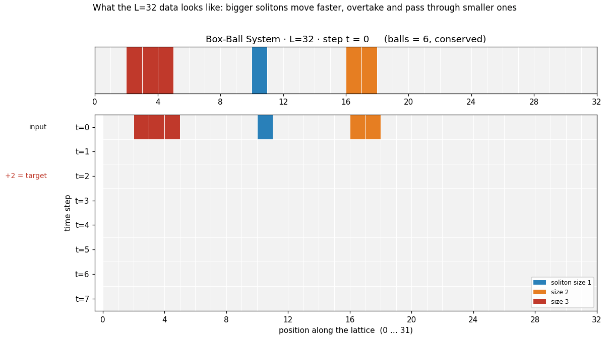
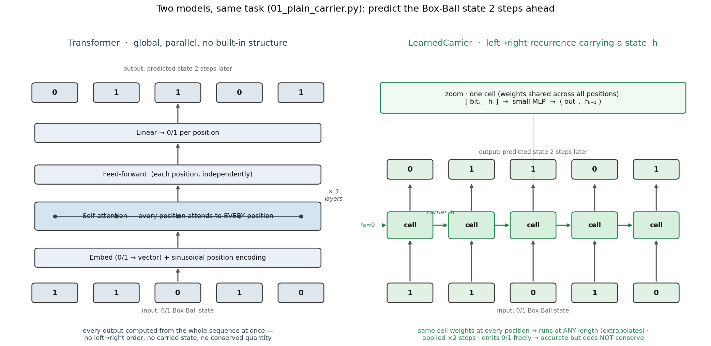
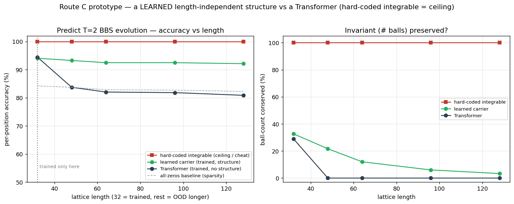
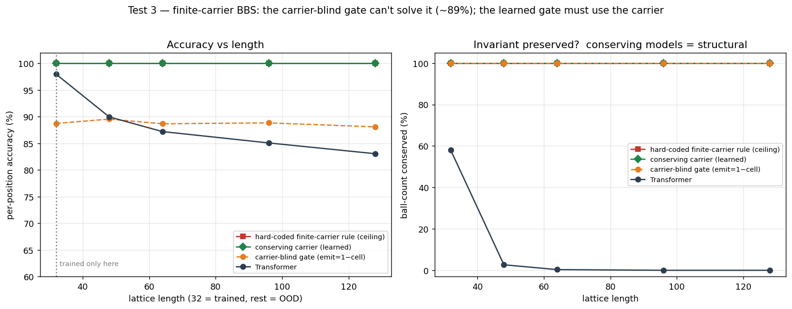

# 在箱球系统上学一个可积模型（3 个 test）

[English](README.md) · **中文**

Demo 2 里,一个硬编的可积规则(箱球系统 BBS)在长度外推上打赢了 Transformer——但那是**作弊**:那个"可积引擎"就是生成标签的规则本身,所以它的 100% 是同义反复。这个文件夹去掉作弊,问真正的问题:

> 一个**真正训练出来**、带可积式归纳偏置的模型,能不能在 BBS 长度任务上打赢 Transformer——并且**靠学习(而非硬编)**白送**精确守恒与可逆**?

**我们一共跑了 3 个 test** —— 它们是**同一个**研究的三次迭代,不是三个独立实验(所以放在一个文件夹里,编号 `01/02/03`)。三者合起来就是 proposal 里的"路线 C"(带可积结构的学习模型)。答案:**能——test 3 拿下了。**

## 任务

BBS 是 KdV 的超离散极限,一个 0/1 格子上的可积元胞自动机:成块的 1 是"孤立子",向右走、互相穿过,球数守恒,动力学精确可逆。任务:给一个 0/1 状态,预测它演化 **2 步**后的状态。所有模型都**只在长度 L=32 上训练**,再测 48/64/96/128——纯粹按长度 OOD(孤立子大小与密度固定)。每个长度上测两样:**逐位准确率**、以及**球数守没守住**。



> `01/02/03` 脚本训练的就是这样的随机 L=32 状态。这里一个 **size-3 孤立子(快)追上 size-1 和 size-2,并从它们中间穿过** —— 前后顺序互换、大小不变、6 个球始终都在。`input`(t=0)和 `+2 = target`(t=2)这两行才是模型真正看到的;多出来的步只是展示动力学。由 [`bbs_data_l32.py`](bbs_data_l32.py) 生成。

## 三个 test 一览

| # | 引入的模型 | 想法 | 结局 |
|---|---|---|---|
| 1 | 普通搬运工 | 去作弊:学出来的左→右扫描,规则是学的不是硬编 | 准确率能外推;**守恒往下漂** |
| 2 | 可逆交换自动机 | 焊保证:守恒与可逆 by construction 精确 | 保证精确,但**学不会** BBS |
| 3 | **守恒搬运工** | 两者合一:搬运工 reach + 每步守恒约束 | **100% 准确率、100% 守恒、100% 可逆** |

**结论一图** —— OOD 长度下的各模型:

| 模型 | 准确率(OOD) | 守恒 | 可逆 | 学的吗 |
|---|---|---|---|---|
| Transformer | 崩(~81%) | ~0% | 否 | 是 |
| 普通搬运工 | ~99% | 漂(76→39%) | 否 | 是 |
| 可逆交换自动机 | ~82%(平庸) | 100% | 100% | 是 |
| **守恒搬运工** | **100%** | **100%** | **100%** | **是** |
| 硬编可积 | 100% | 100% | 100% | 否(作弊) |

两次"失败"不是弯路,而是定位了答案:#1 说明循环买到准确率、买不到不变量;#2 说明"学不会规则的保证"一文不值;#3 保留 #1 的 reach + #2 的纪律,三条全占。

---

## Test 1 — 普通学习搬运工 · 去掉作弊,但不守恒

*脚本:[`01_plain_carrier.py`](01_plain_carrier.py)*

把硬编规则换成一个**学出来的**左→右搬运工——权重共享的循环 cell + 一个小进位状态,只在 L=32 训练、任意长度都能跑。它从数据里学规则(从没见过);硬编可积那条线只当天花板。



> 两个学习模型并排看。**Transformer**:全局自注意力——每个输出都从整条序列一次算出,没有顺序、没有携带的状态、没有守恒量。**搬运工**:一套共享的 cell 从左往右扫、携带一个状态 `h`(像 BBS 的搬运工,但是学的),所以任意长度都能跑。(Test 3 的守恒搬运工,就是在这个扫描上再加了 emit/hold 守恒约束。)



| 长度 | 全 0 基线 | Transformer 准确率/守恒 | 普通搬运工 准确率/守恒 |
|---|---|---|---|
| 32 | 84.2% | 94.5 / 29.0 | 94.1 / 32.7 |
| 48 | 83.7% | 83.7 / 0.0 | 93.3 / 21.7 |
| 64 | 82.9% | 82.0 / 0.0 | 92.5 / 12.0 |
| 96 | 82.7% | 81.8 / 0.0 | 92.5 / 6.0 |
| 128 | 82.3% | 80.9 / 0.0 | 92.1 / 3.3 |

**发现。** 搬运工在所有长度稳在 ~92%,而 Transformer 崩到全 0 基线(OOD 上几乎啥也没学到)。所以"与长度无关、且学得会规则"的结构能外推、注意力不能——作弊去掉了,结论仍成立。**但**它的守恒往 0 漂:循环买到准确率,买不到不变量。

## Test 2 — 可逆交换自动机 · 保证精确,但学不会规则

*脚本:[`02_reversible_swap_ca.py`](02_reversible_swap_ca.py)*

焊保证。一叠相邻格的**门控交换**:交换保守这一对的球数、且是自己的逆;门只读被冻结的邻居 + 交换不变的对内总和,所以整叠**无论学成什么都精确可逆**。随机初始化(没训练)就验证过:所有长度上球数精确守恒、`invert(forward(x)) == x` 精确成立。


| 长度 | Transformer 准确率/守恒 | 普通搬运工 准确率/守恒 | 交换自动机 准确率/守恒 |
|---|---|---|---|
| 32 | 94.8 / 32.0 | 99.6 / 95.7 | 83.3 / **100** |
| 48 | 82.2 / 9.3 | 99.8 / 96.7 | 82.5 / **100** |
| 64 | 80.1 / 1.0 | 99.6 / 93.0 | 81.6 / **100** |
| 96 | 74.8 / 5.7 | 99.5 / 86.0 | 81.5 / **100** |
| 128 | 71.9 / 7.0 | 99.5 / 82.3 | 80.8 / **100** |

**发现。** 守恒平的 100%、可逆精确——保证成立。但**局部**交换结构**学不会** BBS:准确率停在 ~82%(平庸基线),loss 卡在 0.15,而搬运工能到 0.02。BBS 的搬运需要进位的**非局部左→右 reach**,局部门抓不住。**一个学不会规则的结构保证一文不值——这就是"保证 vs 表达力"的张力。**

## Test 3 — 守恒搬运工 · 学得会,且精确守恒 + 可逆

*脚本:[`03_conserving_carrier.py`](03_conserving_carrier.py)*

两者合一。保留**搬运工的 reach**(test 1),把每步更新约束成**守恒**(test 2 的纪律)。进位计数 `k`、格子 `c`,总量 `t = c + k`;保守的结局只有 *emit*(`out=1, k'=t−1`)或 *hold*(`out=0, k'=t`),一个学习的门在两者间选。BBS 本身就是固定规则"cell==0 就 emit"——这里这条规则是**学的**。



| 长度 | Transformer 准确率/守恒 | 普通搬运工 准确率/守恒 | **守恒搬运工** 准确率/守恒 |
|---|---|---|---|
| 32 | 94.5 / 29.0 | 98.9 / 76.3 | **100.0 / 100.0** |
| 48 | 83.7 / 0.0 | 99.1 / 70.7 | **100.0 / 100.0** |
| 64 | 82.0 / 0.0 | 98.7 / 57.3 | **100.0 / 100.0** |
| 96 | 81.8 / 0.0 | 98.4 / 41.0 | **100.0 / 100.0** |
| 128 | 80.9 / 0.0 | 98.4 / 38.7 | **100.0 / 100.0** |

可逆性(整序列,镜像法 `inv = mirror·step·mirror`):**100%**。训练 loss → 0.0001。

**干净的隔离对照。** 普通搬运工(test 1)和守恒搬运工(test 3)**reach 相同、都学得会**,唯一区别是"自由吐"vs"保守 emit/hold"。就这一个改动,把守恒从**漂(76→38%)**变成**平的 100%**——干净证明守恒来自结构约束,而非规模/数据/reach。

### 什么是保证的、什么是学的（精确说法）

- **每步守恒——结构保证(任意门都成立)。** 每步都保守 `格子 + 进位`;门只能在 emit / hold 间选,永远不会凭空造球或灭球。
- **整体输出守恒 = 100%——结构偏置 + 学习。** 输出球数 = 输入球数 − 结束时还留在进位里的球;学到的门在尾部的零上把进位清空了,所以实测守恒精确 100%。(末尾加个确定性 flush 就能变成无条件成立;这次没用上。)
- **可逆性 = 100%——学到的规则 + 结构,已验证。** 模型学到了(本质上)BBS,而 BBS 靠镜像法精确可逆;整序列验证。不是对任意门的硬保证。
- **准确率——学出来的,且能外推。** 权重共享、与长度无关的更新 → 一路 100% 到 L=128。

---

## 诚实边界

1. **单种子、玩具规模、单任务(BBS)。** 数字随种子波动(这就是为什么各 test 里 Transformer / 搬运工那几列略有不同)。正式版需多种子取均值 ± 误差棒。
2. **架构和 BBS 结构高度贴合**(搬运工 + emit/hold)。这正是要点——对的归纳偏置让规则可学、可精确外推——但也意味着现在的开放问题是**普适性**:同一个配方能不能学会**别的**可逆系统(Margolus CA、Toda),而不只是它天生贴合的这一个?
3. **整体守恒依赖进位清空**(这次清空了,100%);加个 flush 就能无条件成立。

## 现状 / 下一步

这就是项目要的那个结果的形状:一个真正训练出来、带可积式偏置的模型,(i) 在 OOD 长度上打赢 Transformer,(ii) 在准确率上追平硬编可积天花板,(iii) 还白送精确守恒与可逆——靠学习达到,不是硬编。下一步是**普适性研究**(同一配方换别的可逆系统、多种子、误差棒)——即 [`../../proposal.md`](../../proposal.md) 里 `data/reversible_systems/` 的计划,也是把它从"干净的 demo"推向"可发表结果"的那一步。

## 复现（CPU,每个几分钟）

```bash
pip install torch numpy matplotlib
python 01_plain_carrier.py        # 去作弊
python 02_reversible_swap_ca.py   # 焊保证（学不会）
python 03_conserving_carrier.py   # 成功那个
```
