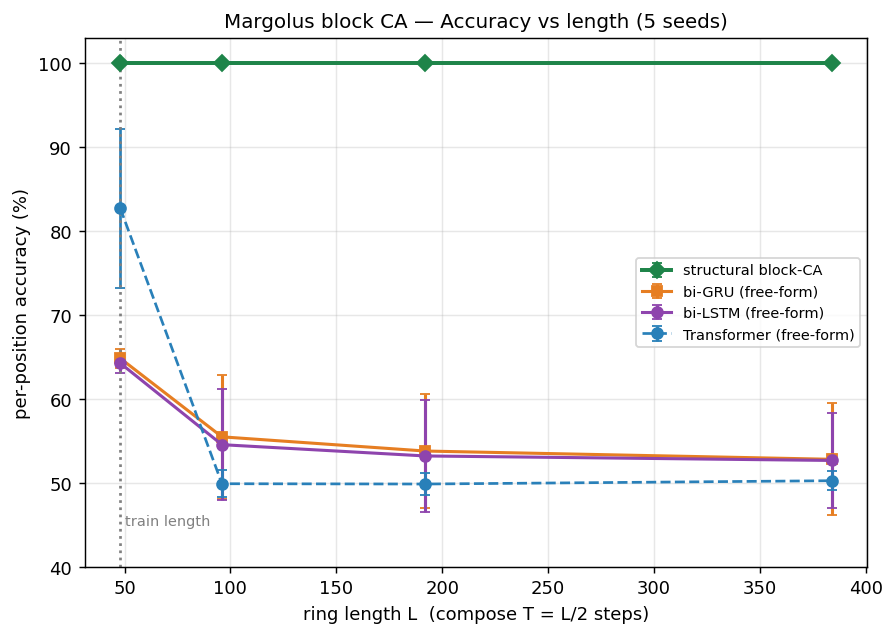
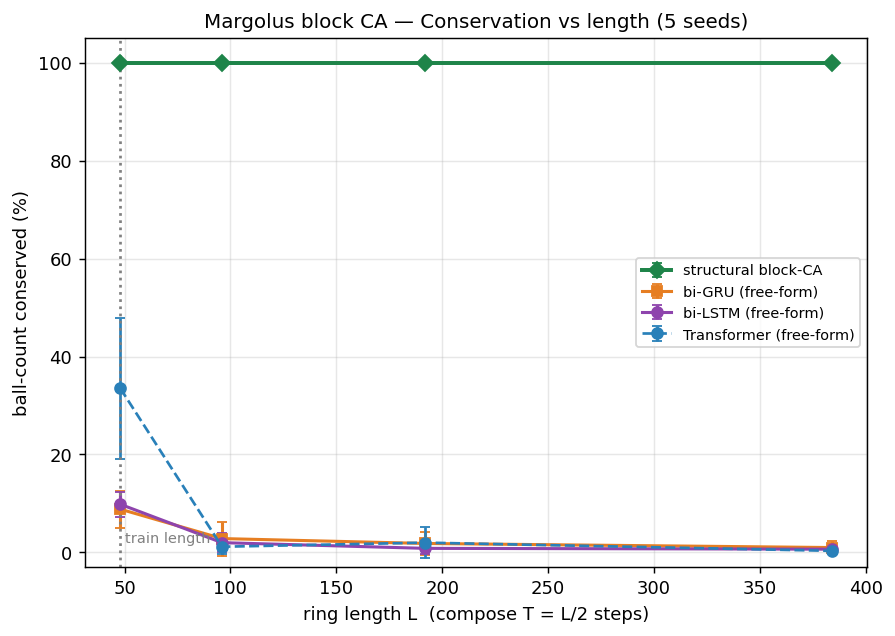

# Structural conservation on a second reversible system — the Margolus block CA

**English** · [中文](README.zh-CN.md)

> **Status: 1D done.** Ground truth ✅ · single-seed probe ✅ · multi-seed rigor (5 seeds, 3 fair baselines) ✅. Optional next: 2D classic Margolus; Chinese write-up.

## Why this experiment

The [Box-Ball experiment](../box_ball_learned_vs_transformer/) showed that welding
**conservation** into a network's *structure* keeps the invariant exact where
free-emit scan models drift. But that was **one** system, and its natural prior is
a long-range left→right **carrier scan**. The open question the proposal raises is
**generality**: does the recipe *transfer* to a reversible system whose natural
structure is different — and does a different system indeed want a different
structure?

Margolus is the deliberate contrast: a **block / partitioning** CA with **no
long-range carrier**. Same recipe (structural conservation + a learned residual),
a genuinely different backbone.

## The system (1D Margolus block CA)

- Ring of length `L` (divisible by 3), periodic boundary.
- **Block size 3**; the partition **offset cycles 0 → 1 → 2** with the step index —
  the 1D analogue of Margolus' alternating neighbourhood.
- Each block is mapped by a fixed permutation **φ** that fixes `000`/`111` and
  **rotates the 1-ball class `{100,010,001}` and the 2-ball class `{110,101,011}`**
  by a 3-cycle. φ is a bijection (**reversibility structural**) and preserves
  ball-count per block (**conservation structural**); it is *not* the identity, so
  the rotation is a **non-trivial residual that must be learned**.

`01_margolus_system.py` establishes the ground truth (self-check + leak audit):

```
ball-count conserved : True
reversible (block-inverse, reversed phase order) : True
leak audit — identity (blind) per-cell accuracy: 52.8%   (≪100% ⇒ rotation is non-trivial)
```

## Why the horizon grows with length (T ∝ L)

Margolus' one-step rule is **local** (range ≈ block size), unlike BBS's O(L) carrier
sweep. At a fixed small horizon *any* model would nail it, so there would be nothing
to measure. To recreate a length-generalization challenge we let the horizon grow
with the ring: **at test length `L` we compose `T = L/2` steps.** A composing model
extrapolates in `T` for free; the question is whether its *invariant* survives the
long composition.

## Result (5 seeds — the formal numbers)

`03_multiseed.py`: every model learns the **single (phase-aware) step**, then
composes `T = L/2` on growing rings; run over 5 seeds. The free-form baselines are
three different architectures — a **bidirectional GRU / LSTM** and a small
**Transformer** (all fair priors: each sees the whole block; a causal GRU, natural
for BBS, is the *wrong* prior here and was rejected). Each free-form model was given
an **ample, equal budget (120 epochs)**, tuned so all reach **~99% single-step** — so
the drift below cannot be dismissed as under-training.

**They all learn the single step (fair):**

| model | single-step acc / cons |
|---|---|
| **structural block-CA** | **100 ± 0 / 100 ± 0** |
| bi-GRU | 98.7 ± 0.1 / 60.7 ± 1.9 |
| bi-LSTM | 98.7 ± 0.1 / 59.7 ± 2.2 |
| Transformer | 99.7 ± 0.3 / 88.6 ± 9.7 |

**…but composed under `T ∝ L`, only the structural model's invariant survives —**
ball-count conserved (%), mean ± std:

| model | L=48 | L=96 | L=192 | L=384 |
|---|---|---|---|---|
| **structural block-CA** | **100 ± 0** | **100 ± 0** | **100 ± 0** | **100 ± 0** |
| bi-GRU | 9 ± 4 | 3 ± 3 | 2 ± 2 | 1 ± 1 |
| bi-LSTM | 10 ± 2 | 2 ± 2 | 1 ± 1 | 1 ± 1 |
| Transformer | 34 ± 14 | 1 ± 2 | 2 ± 3 | 0 ± 1 |

per-position accuracy (%), mean ± std:

| model | L=48 | L=96 | L=192 | L=384 |
|---|---|---|---|---|
| **structural block-CA** | **100 ± 0** | **100 ± 0** | **100 ± 0** | **100 ± 0** |
| bi-GRU | 65 ± 1 | 56 ± 7 | 54 ± 7 | 53 ± 7 |
| bi-LSTM | 64 ± 1 | 55 ± 7 | 53 ± 7 | 53 ± 6 |
| Transformer | 83 ± 9 | 50 ± 2 | 50 ± 1 | 50 ± 1 |




**Reading it.**
- **The drift is not GRU-specific.** Three different fair architectures all learn the
  local step to ~99% and all collapse under long composition — conservation to
  ~0–1%, accuracy to ~chance — while the structural block-CA stays 100/100.
- **A tiny single-step residual is fatal under `T ∝ L`.** Even the Transformer's
  near-perfect 99.7% single step buys only *one* extra length of grace (34% conserved
  at L=48) before its ball-count is gone by L=96. Structural conservation is exact by
  construction and immune to horizon.
- **The Box-Ball finding transfers to a structurally different reversible system, and
  sharpens the thesis: structural conservation matters most precisely when you compose
  many steps — the reversible-systems regime.**

**Honest boundaries.**
- The edge is that a free-form model can't hit *exactly* 100% single-step; the
  structural model gets exactness for free (a same-count output mask). A model that
  reached an exact single step would compose cleanly too — but exactness is the hard
  part, and structure grants it.
- The structural model's 100% *accuracy* here is easy (the local block map is an
  8-entry lookup it learns exactly); the real contrast is **conservation under long
  composition**, not accuracy.
- Same conservation *recipe* as Box-Ball (mask to the conserved subspace + compose),
  different *backbone* (block-partition vs carrier scan). So this system wanted "same
  recipe, different backbone" — **not** a fundamentally different structure. That is
  itself an answer to the proposal's "does each system need a different structure?"
  (here: no).

## Next (optional)

- **2D classic Margolus** (2×2 blocks, e.g. critters / HPP lattice gas) — richer count
  classes, the canonical version. Gated on whether the 1D result needs it; the breadth
  point is already banked here.
- Chinese `README.zh-CN.md`.

## Reproduce (CPU)

```
python3 01_margolus_system.py   # ground truth: conservation + reversibility + leak audit
python3 02_probe.py             # single-seed probe (quick)
python3 03_multiseed.py         # formal 5-seed numbers + figures (MS_QUICK=1 for a fast smoke run)
```
