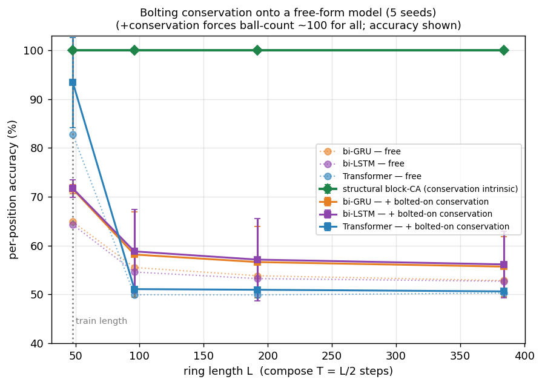

# 结构守恒在第二个可逆系统上——Margolus 块 CA

[English](README.md) · **中文**

> **状态：1D 已完成。** ground truth ✅ · 单种子探针 ✅ · 多种子严谨性（5 种子、3 个公平基线 + 一个"外挂守恒"对照）✅。可选后续：2D 经典 Margolus。

## 为什么做这个实验

[箱球（BBS）实验](../box_ball_learned_vs_transformer/)证明了：把**守恒**焊进网络**结构**里，能在自由吐球模型漂的地方把不变量守死。但那只是**一个**系统，而且它的天然先验是一条长程的左→右**进位扫描**。proposal 提的开放问题是**普适性**：这套配方能不能**迁移**到一个天然结构完全不同的可逆系统上——而且不同的系统是否真的需要不同的结构？

Margolus 是刻意选的反差：一个**块划分**的 CA，**没有长程进位**。同一套配方（结构守恒 + 学残差），一个本质不同的 backbone。

## 系统（1D Margolus 块 CA）

- 长度 `L` 的环（能被 3 整除），周期边界。
- **块大小 3**；划分**偏移随步数循环 0 → 1 → 2**——这是 Margolus 交替邻域的 1D 版。
- 每个块过一个固定置换 **φ**：固定 `000`/`111`，把 1 球类 `{100,010,001}` 和 2 球类 `{110,101,011}` 各做一个 **3-循环旋转**。φ 是双射（**可逆结构自带**），且逐块保球数（**守恒结构自带**）；它**不是**恒等，所以那个旋转是**必须学的非平凡残差**。

`01_margolus_system.py` 立起 ground truth（自检 + 防泄露审计）：

```
ball-count conserved : True
reversible (block-inverse, reversed phase order) : True
leak audit — identity (blind) per-cell accuracy: 52.8%   （≪100% ⇒ 旋转非平凡）
```

## 为什么步数随长度增长（T ∝ L）

Margolus 的单步规则是**局部**的（作用范围 ≈ 块大小），不像 BBS 那样单步就是 O(L) 的进位扫描。固定一个小步数的话，*任何*模型都能学满，就没什么可测的。为了重造一个长度泛化的挑战，我们让步数随环长增长：**在测试长度 `L` 上组合 `T = L/2` 步**。组合型模型在 `T` 上天然外推；真正的问题是它的**不变量**能不能扛过这段长组合。

## 结果（5 种子——正式数字）

`03_multiseed.py`：每个模型都学**单个（带相位的）步**，再在增长的环上组合 `T = L/2`，跑 5 个种子。自由式基线是三种不同架构——**双向 GRU / LSTM** + 一个小 **Transformer**（都是公平先验：每个都能看到整块；BBS 天然的因果单向 GRU 在这里是**错的**先验，已弃用）。每个自由式基线都给了**充足、等量的预算（120 epoch）**，调到都能到 **~99% 单步**——这样下面的漂移就不能用"欠训"搪塞。

**它们单步都学会了（公平）：**

| 模型 | 单步 acc / cons |
|---|---|
| **结构块-CA** | **100 ± 0 / 100 ± 0** |
| bi-GRU | 98.7 ± 0.1 / 60.7 ± 1.9 |
| bi-LSTM | 98.7 ± 0.1 / 59.7 ± 2.2 |
| Transformer | 99.7 ± 0.3 / 88.6 ± 9.7 |

**……但组合到 `T ∝ L` 后，只有结构模型的不变量活下来——** 球数守恒率（%），均值 ± 标准差：

| 模型 | L=48 | L=96 | L=192 | L=384 |
|---|---|---|---|---|
| **结构块-CA** | **100 ± 0** | **100 ± 0** | **100 ± 0** | **100 ± 0** |
| bi-GRU | 9 ± 4 | 3 ± 3 | 2 ± 2 | 1 ± 1 |
| bi-LSTM | 10 ± 2 | 2 ± 2 | 1 ± 1 | 1 ± 1 |
| Transformer | 34 ± 14 | 1 ± 2 | 2 ± 3 | 0 ± 1 |

逐位准确率（%），均值 ± 标准差：

| 模型 | L=48 | L=96 | L=192 | L=384 |
|---|---|---|---|---|
| **结构块-CA** | **100 ± 0** | **100 ± 0** | **100 ± 0** | **100 ± 0** |
| bi-GRU | 65 ± 1 | 56 ± 7 | 54 ± 7 | 53 ± 7 |
| bi-LSTM | 64 ± 1 | 55 ± 7 | 53 ± 7 | 53 ± 6 |
| Transformer | 83 ± 9 | 50 ± 2 | 50 ± 1 | 50 ± 1 |


**怎么读。**
- **漂移不是 GRU 独有。** 三种不同的公平架构，单步都学到 ~99%，组合后全部塌——守恒到 ~0–1%、准确率掉到随机——而结构块-CA 全程 100/100。
- **`T ∝ L` 下，一丁点单步残差就是致命的。** 哪怕 Transformer 单步 99.7%（最好），也只多撑了*一个*长度（L=48 还有 34% 守恒），到 L=96 球数就全没了。结构守恒 by construction 精确、对步数免疫。
- **箱球的发现迁移到了一个结构完全不同的可逆系统上，还把主张磨得更准：结构守恒的价值在"组合很多步"时最大——这正是可逆系统这一类问题的主场。**

**诚实边界。**
- 优势来自"自由式模型学不到**恰好** 100% 单步"；结构模型靠一个"同球数输出 mask"**免费**拿到精确。一个真能到精确单步的模型组合起来也不会漂——但"恰好精确"正是难点，而结构把它白送了。
- 结构模型这里 100% 的**准确率**是容易的（局部块映射就是个 8 项查表，它学得精确）；真正的对比是**长组合下的守恒**，不是准确率。
- 和箱球是**同一套守恒配方**（mask 到守恒子空间 + 组合），只是**换了个 backbone**（块划分 vs 进位扫描）。所以这个系统要的是"同配方、换 backbone"，**不是**另一种根本不同的结构。这本身就回答了 proposal 那个"每个系统是否需要不同结构"的问题（对 Margolus：不需要）。

## 可守恒不就是"焊死"的吗?(把它外挂到自由式模型上)

一个公平的质疑:结构模型 100% 的守恒来自一个**同球数输出 mask**——built-in、不是学的——对*任意*块映射都成立。那**给 LSTM 外挂一个守恒约束**不也能到 100% 吗?前半句对,所以我们测了后半句:用**同一批训好的自由式模型**,只是组合时每步加一个 **top-N 投影**(保留概率最高的 `N` 个格子,`N` = 输入球数)→ 守恒被强制精确。只有吐法变了。

外挂守恒后的准确率(此时守恒**恒等于 100**),均值 ± 标准差:

| 模型 — 自由 → **+外挂守恒** | L=48 | L=96 | L=192 | L=384 |
|---|---|---|---|---|
| bi-GRU | 65 → **72** | 56 → 58 | 54 → 57 | 53 → **56** |
| bi-LSTM | 64 → **72** | 55 → 59 | 53 → 57 | 53 → **56** |
| Transformer | 83 → **93** | 50 → 51 | 50 → 51 | 50 → **51** |
| **结构块-CA(参照)** | 100 | 100 | 100 | **100** |



**诚实的重新表述。**
- **守恒确实可外挂。** 投影把每个自由式模型的球数强制顶到 100%,和怀疑者预言的一模一样。所以"结构守恒稳在 100"这句话**本身**并**不是**有意思的部分。
- **但外挂上去救不回准确率。** 它在短长度上买到一点小提升(拿守恒的球数当约束确实帮了点忙),可组合到 `T ∝ L` 后准确率照样塌到 ~51–56%——只比自由版高一丁点,离结构模型的 100% 差得远。
- **结构真正买到的不是守恒,是"精确"。** 块映射的参数化让规则学到最后一个 bit、于是组合不漂;外挂约束复制不了这一点。守恒只是"**把规则学准**"的免费副产品,而**让规则学准的是结构**。

这正面回答了 proposal 自己那句担忧("守恒约束谁都能给 LSTM 加一个"):在 Margolus 上,确实能——但几乎不改变什么。差距在**组合下的精确性**,不在那个不变量。

## 后续（可选）

- **2D 经典 Margolus**（2×2 块，如 critters / HPP 格子气）——守恒类更丰富，是最经典的版本。是否要做，按 1D 结果够不够硬来 gate；广度这一分 1D 已经拿到。
- （本中文版已补齐。）

## 复现（CPU）

```
python3 01_margolus_system.py   # ground truth：守恒 + 可逆 + 防泄露审计
python3 02_probe.py             # 单种子探针（快）
python3 03_multiseed.py         # 正式 5 种子数字 + 图（MS_QUICK=1 做快速烟测）
```
