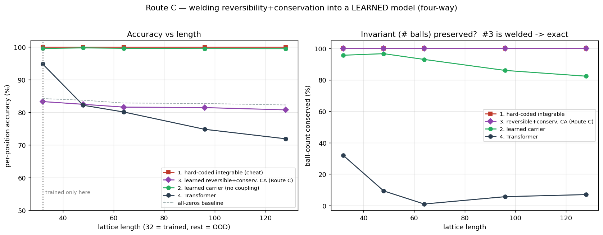

# Experiment · Route C (full) — welding reversibility + conservation into a learned model

**English** · [中文](README.zh-CN.md)

> Script: [`route_c_reversible_ca.py`](route_c_reversible_ca.py)　Figure: [`route_c_reversible_ca.png`](route_c_reversible_ca.png)
> One run (single seed, CPU). Status: an honest partial result — the guarantees work, the accuracy does not (yet). It locates the next design.

## One-line takeaway

**Reversibility and ball-count conservation can be welded into a learned model by construction — verified exact at every length. But the *local gated-swap* structure that gives those guarantees is too weak to learn the BBS rule (accuracy stalls at the trivial baseline).** The two learned models are complementary: the carrier is expressive but doesn't conserve; the reversible CA conserves exactly but can't express the rule. The real Route C must unify both.

## The four models

| # | Line | Structure | Rule | Reversible / conserving | Role |
|---|---|---|---|---|---|
| 1 | Hard-coded integrable | BBS carrier rule | written in (cheat) | exact, by construction | ceiling |
| 2 | Learned carrier | weight-shared left→right scan (nonlocal reach) | **learned** | approximate (drifts) | expressive, no guarantee |
| 3 | **Reversible+conserv. CA (Route C)** | gated swaps of adjacent pairs; gate reads only frozen context + swap-invariant sum | **learned** | **exact, by construction** | guaranteed, but local |
| 4 | Transformer | generic attention | learned | none | lower bound |

**#3's guarantee, verified before training** (self-check at random init): ball-count conserved exactly and `invert(forward(x)) == x` exactly, at L = 32/48/64/96/128. A swap conserves the pair's count and is its own inverse; the gate reads only cells frozen this layer + the pair's own (swap-invariant) sum → the whole stack is exactly invertible no matter what it learns.

## Results (trained on L=32 only; tested OOD by length)

| Length | all-zeros | Transformer acc / cons | Carrier acc / cons | **Route C CA** acc / cons | Integrable |
|---|---|---|---|---|---|
| 32 (train) | 84.2% | 94.8 / 32.0 | 99.6 / 95.7 | 83.3 / **100** | 100 / 100 |
| 48 | 83.7% | 82.2 / 9.3 | 99.8 / 96.7 | 82.5 / **100** | 100 / 100 |
| 64 | 82.9% | 80.1 / 1.0 | 99.6 / 93.0 | 81.6 / **100** | 100 / 100 |
| 96 | 82.7% | 74.8 / 5.7 | 99.5 / 86.0 | 81.5 / **100** | 100 / 100 |
| 128 | 82.3% | 71.9 / 7.0 | 99.5 / 82.3 | 80.8 / **100** | 100 / 100 |

## Reading the result

**① The guarantees can be welded (positive, verified).** Route C's conservation is a flat 100% at every length and its reversibility is exact — structurally, not learned, so it never drifts. This is the thing the previous prototype's carrier could not give.

**② But this structure can't learn the rule (negative, honest).** Route C's accuracy stalls at ~82% — essentially the all-zeros/identity baseline. Its training loss plateaus at ~0.15 while the carrier reaches ~0.02. The *local* gated-swap CA moves balls only between adjacent cells with a locally-decided gate; BBS transport depends on a running carrier count accumulated left→right, which a local gate + a shared shallow stack does not capture. Conservation buys nothing for accuracy here.

**③ The tension is the finding.** The two learned models sit at opposite corners:
- **Carrier (#2):** nonlocal reach → learns the rule (99.5% at all lengths), but conserves only approximately (drifts 96→82%).
- **Reversible CA (#3):** exact conservation + reversibility by construction, but the local structure can't express the rule (~82%).

Neither gets both. **The guarantee and the expressivity currently live in different architectures.**

## Honest boundaries

1. **Single run, single seed, toy scale.** Numbers wobble across seeds (the carrier here looks stronger than in the earlier prototype experiment for exactly this reason).
2. **The negative on #3 is about *this* structure, not a proof of impossibility.** A local gated-swap CA is one particular reversible/conservative family; that it can't learn BBS well does not mean no reversible+conservative model can. Discrete routing is also hard to train (soft-train / hard-eval, temperature-annealed here).
3. **What is solid:** the structural guarantees themselves (verified exact), and the complementary-tradeoff picture.

## Next step (the true Route C)

Combine the two corners: a model that has the carrier's **left→right reach** *and* #3's **structural reversibility + conservation**. Concretely, make the *carrier itself* reversible and mass-conserving (a reversible recurrent pass that transports balls rather than emitting them freely), so a single architecture lands the accuracy of #2 with the flat-100% conservation of #3. That is the version that would turn this four-way from "a tension" into "one line that tracks the ceiling on both panels."
